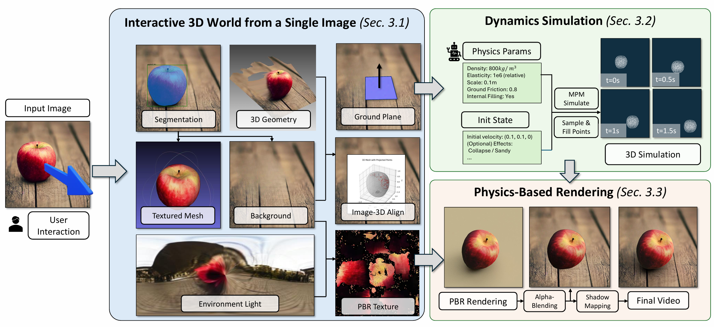

<br />
<p align="center">

  <h1 align="center">PHysGen3D: Crafting a Miniature Interactive <br> World from a Single Image</h1>

  <p align="center">
   CVPR, 2025
    <br />
    <a href="https://by-luckk.github.io "><strong>Boyuan Chen</strong></a>
    ·
    <a href="https://jianghanxiao.github.io"><strong>Hanxiao Jiang</strong></a>
    ·
    <a href="https://stevenlsw.github.io"><strong>Shaowei Liu</strong></a>
    ·
    <a href="https://saurabhg.web.illinois.edu/"><strong>Saurabh Gupta</strong></a>
    ·
    <a href="https://yunzhuli.github.io/"><strong>Yunzhu Li</strong></a>
    ·
    <a href="https://sites.google.com/view/fromandto"><strong>Hao Zhao</strong></a>
    ·
    <a href="https://shenlong.web.illinois.edu/"><strong>Shenlong Wang</strong></a>
  </p>

<p align="center"> 

</p>

  <p align="center">
    <a href='https://arxiv.org/pdf/2503.20746'>
      </a>
    <a href='https://arxiv.org/abs/2503.20746' style='padding-left: 0.5rem;'></a>
    <a href='https://by-luckk.github.io/PhysGen3D/' style='padding-left: 0.5rem;'>
      </a>
  </p>

</p>
<br />

This repository contains the implementation for the paper [PHysGen3D: Crafting a Miniature Interactive World from a Single Image](https://by-luckk.github.io/PhysGen3D/), CVPR 2025. In this paper, we present a novel framework that transforms a single image into an amodal, camera-centric, interactive 3D scene. 

## Overview


## Structure

The folders are exsisting wheels used in the projects. "engine" folder contains the core of taichi-elements. 

Run ```perception.py``` to run the perception part.

Run ```ball_sim.py``` ```mpm_sim.py``` to run several demos of mpm method.

## Installation

```bash
conda create -y -n phys python=3.10
conda activate phys
git clone --recurse-submodules git@github.com:by-luckk/PhysGen3D.git
cd PhysGen3D
bash env_install/env_install.sh
bash env_install/download_pretrained.sh

## Usage

The examples below are provided for the demo images in `data/img/`. The `teddy.jpg` can be substituted with any other images. `${name}` is the name of the image.

### Run the perception part

```bash
python perception.py --input_image data/img/teddy.jpg --text_prompt teddy
```
- The text prompt discribes the object you want to move. It's in format of a single word or multiple words seperated by `.` like `cat.dog`. 
- Outputs are saved in `outputs/${name}` as follows:


  ```Shell
  ${name}/
    ├── depth # Depth point cloud
    ├── images # Multiview object images
    ├── inpaint # Background inpainting
    ├── mask # Object masks
    ├── meshes # Mesh reconstruction
    ├── object # Object registration results
    ├── grounded_sam_output.jpg
    ├── raw_image.jpg
    └── transform.json # Geometries
  ```

### Run the simulation part

```bash
python simulation.py --config data/sim/teddy.yaml
```
- You can manually set all the physical parameters or [get them automatically](assets/gpt.md) using GPT-4o. 
- `Velocities` is the initial velocity of object(s), in 1D or 2D array: `[Vx, Vy, Vz]` or `[[Vx1, Vy1, Vz1], [Vx2, Vy2, Vz2]]`. 
- The outputs are saved in `sim_result/sim_result_${time}` folder.

### Run the rendering part

```bash
python rendering.py \
-i ./sim_result/sim_result_${time} \
--path outputs/teddy \
--env data/hdr/teddy.exr \
-b 0 \
-e 100 \
-f \
-s 1 \
-o render_result/1 \
-M 460 \
-p 20 \
--shutter-time 0.0
```

<!-- ```bash
bash scripts/run_mitsuba.sh
  ``` -->

- In `run_mitsuba.sh`, put your simulation results folder `sim_result/sim_result_${time}` after `-i`. 
- It runs the teddy bear demo by default. For other demos, put perception result `outputs/${name}` after `--path` and env light file `data/hdr/teddy.exr` after `--env`.
- The outputs and the final video are saved in `render_result` folder.

### Prepare your own image

